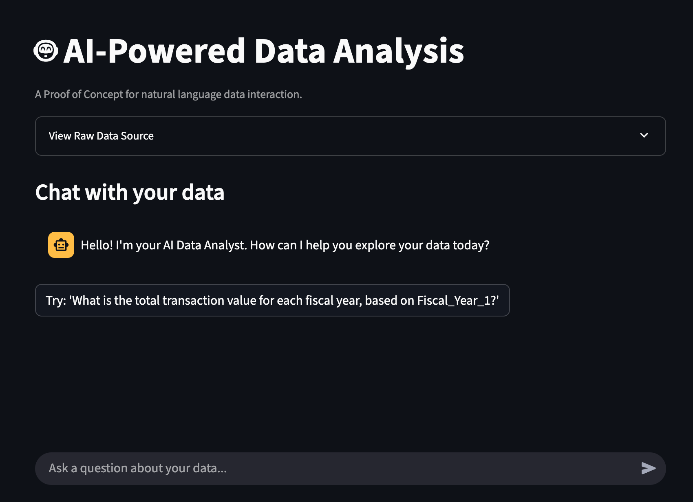

# AI-Powered Data Analysis - Proof of Concept

This repository contains the Proof of Concept (PoC) for an AI-powered data analysis tool. It was developed to showcase a solution for **Jäppinen Ltd.**, enabling non-technical users to ask complex questions about their data using natural language.

> This project demonstrates how a Large Language Model (LLM) can act as a "data analyst in a box," translating plain English into SQL queries, executing them, and visualizing the results.

---

## 📸 Application Preview & Demo

* **Live Demo (Loom):** 

* **Deployed App (Lightning AI):** [Interact with the live PoC here](https://www.loom.com/share/c37018e3d1c14ac9af0c42264242e081?sid=7bb2a435-27ca-407f-bcd8-e6605fdf914a)

## ✨ Core Features

* **Natural Language Querying:** Ask questions in plain English, just like talking to a human analyst.
* **Conversational Context:** The AI remembers previous questions, allowing for intuitive follow-up queries.
* **Data Profiling & Exploration:** Get quick summaries, unique values, date ranges, and more.
* **Data Quality Analysis:** Identify null values, duplicates, outliers, and inconsistencies.
* **Automated Visualizations:** The app automatically generates interactive Plotly charts to best represent the data.
* **Code Transparency:** Optionally view the exact SQL query and Python visualization code generated by the AI for each response.

## 🛠️ Technology Stack

* **Framework:** [Streamlit](https://streamlit.io/) for the interactive web UI.
* **Language:** Python 3.9+
* **AI Model:** OpenAI `gpt-4o-mini`
* **Data Manipulation:** [Pandas](https://pandas.pydata.org/)
* **Query Engine:** [pandasql](https://pypi.org/project/pandasql/) to run SQL on DataFrames.
* **Charting:** [Plotly](https://plotly.com/python/) for interactive data visualizations.
* **Development:** [Lightning AI](https://lightning.ai/)
* **Deployment:** [Lightning AI](https://lightning.ai/)