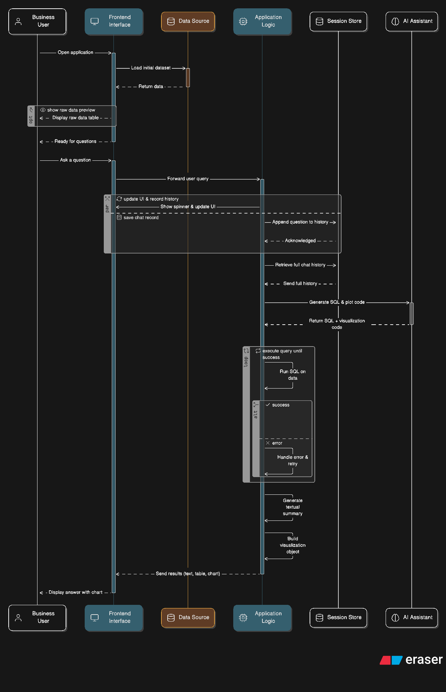
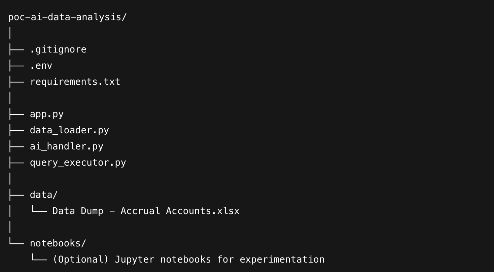

# Developer Documentation: AI Data Analysis PoC

This document provides all the necessary information for developers contributing to or maintaining the AI Data Analysis Proof of Concept (PoC) for **Jäppinen Ltd.**

---

## 1. Overview & Architecture

### High-Level Description

This project is a Proof of Concept (PoC) designed to demonstrate the viability of an AI-powered data profiling tool for non-technical business users. The application allows users to ask questions about their data in natural language, and it responds with data tables, visualizations, and textual summaries.

The core of the application is a web-based, conversational interface (a "chatbot") that:
- Translates user questions into SQL queries.
- Executes them on a dataset.
- Generates appropriate visualizations and summaries of the results.

### Modules and Components

The system is a monolithic **Streamlit** application with clear separation of concerns into distinct modules:

-   **Frontend (UI Layer — `app.py`)**:
    Web interface built with Streamlit. Renders chat history, captures input, and displays results (data tables, Plotly charts, code snippets).

-   **Backend (App Logic — `app.py`)**:
    Core Python logic that orchestrates the entire workflow. Handles session state, prompt construction, and module communication.

-   **Data Loader (`data_loader.py`)**:
    Loads data from Excel, sanitizes column names, and extracts schema context for the AI.

-   **AI Handler (`ai_handler.py`)**:
    Manages OpenAI API interaction for:
    1.  SQL query generation
    2.  Plotly code generation
    3.  Summary text generation

-   **Query Executor (`query_executor.py`)**:
    Executes SQL on pandas DataFrame using `pandasql` with robust error handling.

-   **Session State (`st.session_state` in `app.py`)**:
    Stores the conversation context — including user messages, responses, data, plots, and code.

### Architecture Diagram



---

## 2. Codebase Structure

### Folder and File Structure



#### Naming Conventions

* **Python Code**: Follows PEP 8
* **Files & Modules**: `snake_case`
* **Variables & Functions**: `snake_case`
* **Classes**: `PascalCase` (not used in this PoC)

#### How to Navigate the Code

1.  **Start at `app.py`**: This is the entry point. Look under the `if prompt:` block.
2.  **Trace data flow**: `data_loader.py` → `ai_handler.generate_sql` → `query_executor.execute_query` → AI summaries/plots.
3.  **Inspect AI prompts**: Check `ai_handler.py` for debugging or improvement.

---

## 3. Development Setup

### Environment Configuration

* **Python Version**: 3.9+
* **Dependencies**: Listed in `requirements.txt`
* **Tools**:
    * `pip`
    * `git`
    * Lightning AI for collaboration/presentation

### Installation

1.  **Clone the repository**:
    ```bash
    git clone [https://github.com/AdamPrzychodniPrivate/poc-ai-data-analysis.git](https://github.com/AdamPrzychodniPrivate/poc-ai-data-analysis.git)
    cd poc-ai-data-analysis
    ```

2.  **Create and activate a virtual environment**:
    ```bash
    python -m venv venv
    source venv/bin/activate  # On Windows: venv\Scripts\activate
    ```

3.  **Install dependencies**:
    ```bash
    pip install -r requirements.txt
    ```

4.  **Create `.env` file**:
    ```ini
    OPENAI_API_KEY="sk-proj-..."
    ```

5.  **Run the application**:
    ```bash
    streamlit run app.py
    ```

### IDE Setup

Use any Python IDE (e.g., VS Code, PyCharm). For VS Code:

* Install Python extension.
* Enable auto-format on save (Black, Flake8, etc.).

---

## 4. Code Style Guide

* **Standard**: PEP 8
* **Formatters**: Black
* **Linters**: Flake8, Pylint

Auto-formatting on save is recommended in IDE settings.

---

## 5. API Documentation (Module Functions)

### `data_loader.py`

* `load_data(file_path: str) -> Optional[pd.DataFrame]`
    * Loads and sanitizes Excel data.
    * **Args**:
        * `file_path (str)`: Path to Excel file.
    * **Returns**: DataFrame or `None`.
    * **Returns**: `None`

* `get_schema(df: Optional[pd.DataFrame]) -> str`
    * Formats schema from DataFrame for use in AI prompt.
    * **Args**:
        * `df (pd.DataFrame)`
    * **Returns**: `str`
    * **Returns**: `None`

### `query_executor.py`

* `execute_query(sql_query: str, df: pd.DataFrame) -> Tuple[Optional[pd.DataFrame], Optional[str]]`
    * Runs SQL query on DataFrame.
    * **Args**:
        * `sql_query (str)`
        * `df (DataFrame)`
    * **Returns**:
        * `DataFrame | None`
        * `error_message | None`
    * **Returns**: `None`

### `ai_handler.py`

* `generate_sql(chat_history: List[Dict[str, str]], schema: str) -> str`
    * Generates SQL from chat context and schema.
    * **Args**:
        * `chat_history (List[Dict])`
        * `schema (str)`
    * **Returns**: `str` SQL
    * **Returns**: `None`

* `generate_plotly_code(data: pd.DataFrame, question: str) -> str`
    * Generates Plotly Python code.
    * **Args**:
        * `data (DataFrame)`
        * `question (str)`
    * **Returns**: `str` of code
    * **Returns**: `None`

* `generate_data_summary(data: pd.DataFrame, question: str) -> str`
    * Summarizes data in natural language.
    * **Args**:
        * `data (DataFrame)`
        * `question (str)`
    * **Returns**: `str` summary
    * **Returns**: `None`

---

## 6. Testing Guide

### Strategy

Manual, scenario-based testing to simulate real user interactions.

### Scenario Categories

* Data Profiling & Exploration
* Data Quality & Anomaly Detection
* Simple Business Questions
* Conversational Memory & Follow-up

### Running Tests

1.  **Launch app**: `streamlit run app.py`
2.  Input questions from test scenarios.
3.  Validate responses: table, chart, summary.
4.  Test follow-up context across steps.

### Writing New Tests

1.  Define Goal.
2.  User Question (natural language).
3.  Expected Output.
4.  Document in testing plan.

---

## 7. Deployment Instructions

### CI/CD Pipeline (Recommended for Prod)

Use GitHub Actions to:

* Trigger on `main` branch push.
* Install dependencies.
* Run linting (Flake8).
* (Optional) Add unit/integration tests.
* Deploy to:
    * Lightning AI
    * Streamlit Cloud
    * Private cloud

### Manual Deployment (Lightning AI)

1.  Create Lightning AI workspace.
2.  Link GitHub repo.
3.  Set environment variable `OPENAI_API_KEY`.
4.  Run:
    ```bash
    streamlit run app.py
    ```
5.  Share public URL from Lightning.

---

## 8. Versioning & Changelog

### Versioning: SemVer

* **MAJOR**: Incompatible changes.
* **MINOR**: Features, backward-compatible.
* **PATCH**: Bug fixes.

Initial version: `0.1.0`

### Changelog

**[0.1.0] - 2025-06-25**

**Added:**

* Initial Proof of Concept.
* Conversational Streamlit UI.
* Excel data loading into pandas.
* Natural language to SQL via OpenAI (gpt-4o-mini).
* Query execution and contextual memory.
* Plotly visualizations.
* AI-generated summaries.
* Expanders for raw data, code, results.
* "Try me" button.
* `.env` support.
* Modularized codebase.